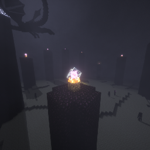

# DrGreenus Crystal Optimizer

  

A high-performance **Fabric** mod for Minecraft 1.21.11 that optimizes Crystal PvP by instantly removing destroyed End Crystal entities.

## ✨ Features
* **Zero Latency:** Instantly removes crystals on the client side.
* **No Ghost Crystals:** Previces visual glitches during fast-paced PvP.
* **Performance:** Lightweight code that doesn't impact your FPS.

## 🛠 Installation
1. Ensure you have **Fabric Loader** installed for 1.21.11.
2. Download the latest release from [Modrinth](LINK_DO_TWOJEGO_MODRINTHA).
3. Place the `.jar` file and **Fabric API** in your `mods` folder.

# 📢 Join my Discord!

[CLICK](TWÓJ_LINK_ZAPROSZENIOWY)

## 📜 License
This project is licensed under the **MIT License**.

